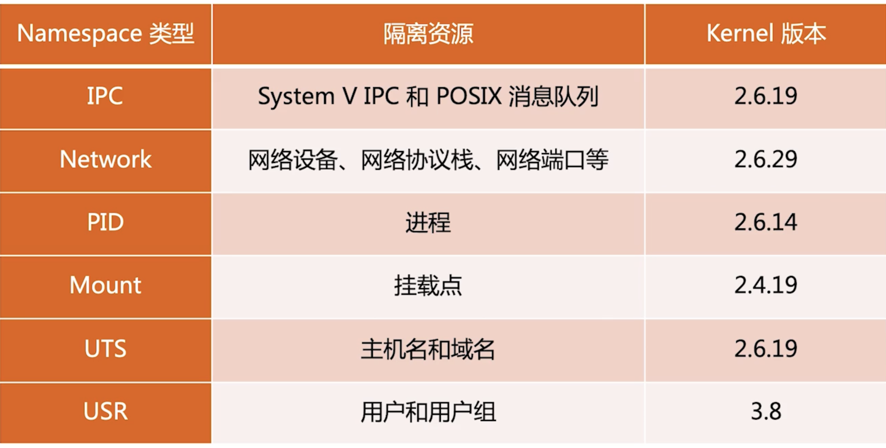
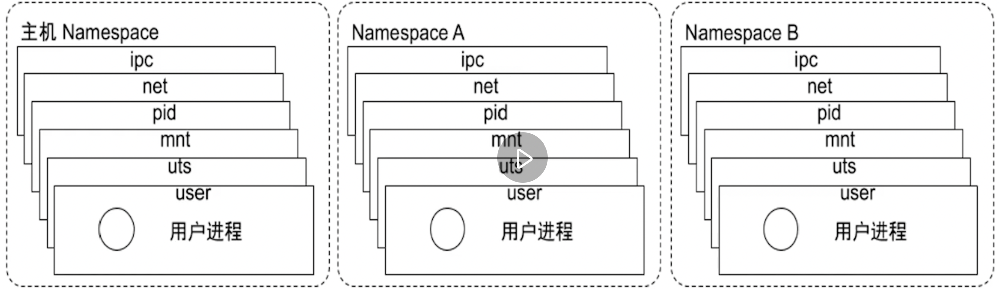

[toc]

# Docker核心技术 一

## linux对Namespace的操作方法

- clone 

在创建新进程的系统调用时，可以通过flags参数指定需要新的namespace类型

- setns 
  
系统调用可以让调用进程加入已存在的namespace

- unshare
  
系统调用可以让调用进程加入新的namespace

## 隔离性 namespace 



- 用户进程




- Pid namespace

不同的用户进程就是通过pid namespace隔离开的，不同的namespace有相同的pid

- net namespace 

网络隔离通过net namespace 隔离的，每个net namespace 有独立的network device ,ip address 

docker 采用veth的方式 

- ipc namespace 

进程之间要交流，通过IPC,包括常见的信号量，消息队列和信号共享。

- mnt namespace 
  
允许不同的namespce 看到的文件结构不同
- uts namespace 

每个进程拥有独立的hostname和 domain name 

- user namespace 
 
每个进程都有独立的用户管理系统

## 实践

- 查看当前的namespace 

```
root@k8s-master:~# lsns -t net
        NS TYPE NPROCS   PID USER     NETNSID NSFS                           COMMAND
4026531992 net     195     1 root  unassigned /run/docker/netns/default      /sbin/init noibrs
4026532284 net       2 18022 65535          0 /run/docker/netns/299de63bab68 /pause
4026532353 net       2 18081 65535          1 /run/docker/netns/b38c0f8c94bf /pause
4026532369 net       1 18080 65535          2 /run/docker/netns/365171aeb748 /pause
4026532501 net       1 18881 65535          3 /run/docker/netns/d47f9b34b64c /pause
```
- 查看某进程的namespace 

ls -la /proc/<pid>/ns

 ```
 root@k8s-master:~# cd /proc/18881/ns/
root@k8s-master:/proc/18881/ns# ls
cgroup  ipc  mnt  net  pid  pid_for_children  user  uts
root@k8s-master:/proc/18881/ns# ll
total 0
dr-x--x--x 2 65535 65535 0 Oct 11 21:35 ./
dr-xr-xr-x 9 65535 65535 0 Oct 11 21:35 ../
lrwxrwxrwx 1 65535 65535 0 Oct 11 21:35 cgroup -> 'cgroup:[4026531835]'
lrwxrwxrwx 1 65535 65535 0 Oct 11 21:35 ipc -> 'ipc:[4026532498]'
lrwxrwxrwx 1 65535 65535 0 Oct 11 21:35 mnt -> 'mnt:[4026532496]'
lrwxrwxrwx 1 65535 65535 0 Oct 11 21:35 net -> 'net:[4026532501]'
lrwxrwxrwx 1 65535 65535 0 Oct 11 21:35 pid -> 'pid:[4026532499]'
lrwxrwxrwx 1 65535 65535 0 Oct 11 21:35 pid_for_children -> 'pid:[4026532499]'
lrwxrwxrwx 1 65535 65535 0 Oct 11 21:35 user -> 'user:[4026531837]'
lrwxrwxrwx 1 65535 65535 0 Oct 11 21:35 uts -> 'uts:[4026532497]'
 ```

- 进入某namespace运行命令

nsenter -t <pid> -n ip addr


```
root@k8s-master:/proc/18881/ns# nsenter -t 18881 -n ip addr
1: lo: <LOOPBACK,UP,LOWER_UP> mtu 65536 qdisc noqueue state UNKNOWN group default qlen 1000
    link/loopback 00:00:00:00:00:00 brd 00:00:00:00:00:00
    inet 127.0.0.1/8 scope host lo
       valid_lft forever preferred_lft forever
3: eth0@if10: <BROADCAST,MULTICAST,UP,LOWER_UP> mtu 1450 qdisc noqueue state UP group default 
    link/ether d6:fb:34:9a:09:1d brd ff:ff:ff:ff:ff:ff link-netnsid 0
    inet 192.168.235.196/32 scope global eth0
       valid_lft forever preferred_lft forever
```

