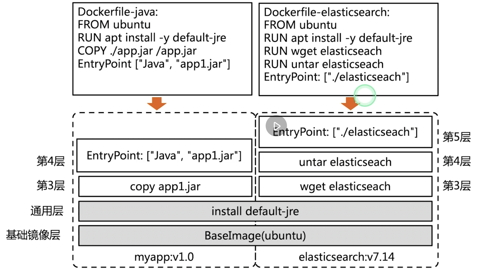

[toc]

# Docker核心技术 一

## linux对Namespace的操作方法

- clone 

在创建新进程的系统调用时，可以通过flags参数指定需要新的namespace类型

- setns 
  
系统调用可以让调用进程加入已存在的namespace

- unshare
  
系统调用可以让调用进程加入新的namespace

## 隔离性 namespace 


- 用户进程


- Pid namespace

不同的用户进程就是通过pid namespace隔离开的，不同的namespace有相同的pid

- net namespace 

网络隔离通过net namespace 隔离的，每个net namespace 有独立的network device ,ip address 

docker 采用veth的方式 

- ipc namespace 

进程之间要交流，通过IPC,包括常见的信号量，消息队列和信号共享。

- mnt namespace 
  
允许不同的namespce 看到的文件结构不同
- uts namespace 

每个进程拥有独立的hostname和 domain name 

- user namespace 
 
每个进程都有独立的用户管理系统

## Namespace 实践

- 查看当前的namespace 

```
root@k8s-master:~# lsns -t net
        NS TYPE NPROCS   PID USER     NETNSID NSFS                           COMMAND
4026531992 net     195     1 root  unassigned /run/docker/netns/default      /sbin/init noibrs
4026532284 net       2 18022 65535          0 /run/docker/netns/299de63bab68 /pause
4026532353 net       2 18081 65535          1 /run/docker/netns/b38c0f8c94bf /pause
4026532369 net       1 18080 65535          2 /run/docker/netns/365171aeb748 /pause
4026532501 net       1 18881 65535          3 /run/docker/netns/d47f9b34b64c /pause
```
- 查看某进程的namespace 

ls -la /proc/<pid>/ns

 ```
 root@k8s-master:~# cd /proc/18881/ns/
root@k8s-master:/proc/18881/ns# ls
cgroup  ipc  mnt  net  pid  pid_for_children  user  uts
root@k8s-master:/proc/18881/ns# ll
total 0
dr-x--x--x 2 65535 65535 0 Oct 11 21:35 ./
dr-xr-xr-x 9 65535 65535 0 Oct 11 21:35 ../
lrwxrwxrwx 1 65535 65535 0 Oct 11 21:35 cgroup -> 'cgroup:[4026531835]'
lrwxrwxrwx 1 65535 65535 0 Oct 11 21:35 ipc -> 'ipc:[4026532498]'
lrwxrwxrwx 1 65535 65535 0 Oct 11 21:35 mnt -> 'mnt:[4026532496]'
lrwxrwxrwx 1 65535 65535 0 Oct 11 21:35 net -> 'net:[4026532501]'
lrwxrwxrwx 1 65535 65535 0 Oct 11 21:35 pid -> 'pid:[4026532499]'
lrwxrwxrwx 1 65535 65535 0 Oct 11 21:35 pid_for_children -> 'pid:[4026532499]'
lrwxrwxrwx 1 65535 65535 0 Oct 11 21:35 user -> 'user:[4026531837]'
lrwxrwxrwx 1 65535 65535 0 Oct 11 21:35 uts -> 'uts:[4026532497]'
 ```

- 进入某namespace运行命令

nsenter -t <pid> -n ip addr


```
root@k8s-master:/proc/18881/ns# nsenter -t 18881 -n ip addr
1: lo: <LOOPBACK,UP,LOWER_UP> mtu 65536 qdisc noqueue state UNKNOWN group default qlen 1000
    link/loopback 00:00:00:00:00:00 brd 00:00:00:00:00:00
    inet 127.0.0.1/8 scope host lo
       valid_lft forever preferred_lft forever
3: eth0@if10: <BROADCAST,MULTICAST,UP,LOWER_UP> mtu 1450 qdisc noqueue state UP group default 
    link/ether d6:fb:34:9a:09:1d brd ff:ff:ff:ff:ff:ff link-netnsid 0
    inet 192.168.235.196/32 scope global eth0
       valid_lft forever preferred_lft forever
```


在新network namespace 执行sleep命令

```
root@k8s-master:/proc/18881/ns# unshare -fn sleep 600
```


```
root@k8s-master:~# ps -ef | grep sleep 
root       34436    1071  0 21:47 pts/0    00:00:00 unshare -fn sleep 600
root       34437   34436  0 21:47 pts/0    00:00:00 sleep 600
root       34446   31348  0 21:47 pts/1    00:00:00 grep --color=auto sleep
root@k8s-master:~# nsenter -t 1071 -n ip addr
1: lo: <LOOPBACK,UP,LOWER_UP> mtu 65536 qdisc noqueue state UNKNOWN group default qlen 1000
    link/loopback 00:00:00:00:00:00 brd 00:00:00:00:00:00
    inet 127.0.0.1/8 scope host lo
       valid_lft forever preferred_lft forever
    inet6 ::1/128 scope host 
       valid_lft forever preferred_lft forever
```


## Cgroup 

- 对一组进程进行资源控制和监控的机制 
- 可以对CPU使用时间，内存，磁盘进行限制 
  
## Linux内核中Cgroup的实现

## 可配量/可度量- Control Groups


cgroup 实现了对资源的配额和度量

- blkio 每个设备的输入和输出
- cpu  分配时间片 
- cpuacct 生产cgroup任务的cpu资源报告
- cpuset 
- devices 允许或拒绝cgroup对设备的访问
- memory 

## CPU子系统 

- cpu.shares 可以获得CPU使用时间的相对值
进程之间按照cpu的相对值分配

- cpu.cfs_period_us  cfs_period_us 用来配置时间周期长度 单位微秒，绝对值
   
- cpu.cfs_quota_us  最多使用cpu时间数


```
root@k8s-master:/proc/18881/ns#  cd /sys/fs/cgroup/
root@k8s-master:/sys/fs/cgroup# ls
blkio  cpu  cpuacct  cpu,cpuacct  cpuset  devices  freezer  hugetlb  memory  net_cls  net_cls,net_prio  net_prio  perf_event  pids  rdma  systemd  unified
root@k8s-master:/sys/fs/cgroup# cd cpu
root@k8s-master:/sys/fs/cgroup/cpu# ls
aegis                  cgroup.procs          cpuacct.usage         cpuacct.usage_percpu_sys   cpuacct.usage_user  cpu.shares  kubepods.slice     system.slice
assist                 cgroup.sane_behavior  cpuacct.usage_all     cpuacct.usage_percpu_user  cpu.cfs_period_us   cpu.stat    notify_on_release  tasks
cgroup.clone_children  cpuacct.stat          cpuacct.usage_percpu  cpuacct.usage_sys          cpu.cfs_quota_us    init.scope  release_agent      user.slice
```


## Linux调度 

CFS（Completely Fair Scheduler）调度器 cfs_sched_class 完全公平调度器,引入虚拟时间概念。

## Vruntime红黑树 


## CFS进程调度


## 实验(利用cgroup压制一个程序的资源)

占用两个cpu的程序 

```
func main() {
	go func() {

		for {

		}
	}()

	for {

	}
}
```


运行二进制程序

查看top 

```
Tasks: 201 total,   2 running, 199 sleeping,   0 stopped,   0 zombie
%Cpu(s): 92.5 us,  7.1 sy,  0.0 ni,  0.2 id,  0.0 wa,  0.0 hi,  0.2 si,  0.0 st
MiB Mem :   3744.5 total,    130.7 free,   1154.1 used,   2459.7 buff/cache
MiB Swap:      0.0 total,      0.0 free,      0.0 used.   2334.1 avail Mem 

    PID USER      PR  NI    VIRT    RES    SHR S  %CPU  %MEM     TIME+ COMMAND                                                                                                                                    
  98460 root      20   0  702360    936    648 R 160.9   0.0   0:21.80 busyloop                                                                                                                                   
   2650 root      20   0 1382044 450380  77508 S  10.3  11.7   6:38.19 kube-apiserver                                                                                                                             
   3033 root      20   0 1990424 152680  80224 S   4.0   4.0   3:32.38 kubelet                                                                                                                                    
    825 root      10 -10  123688  32352  16364 S   3.6   0.8   3:33.82 AliYunDun                                                                                                                                  
   5666 root      20   0  822712 114604  67468 S   3.0   3.0   1:29.14 kube-controller                                                                                                                            
   2724 root      20   0   10.7g  72624  27912 S   2.3   1.9   2:04.92 etcd                                                                                                                                       
    780 root      20   0 1950456 102396  51888 S   2.0   2.7   2:11.54 dockerd                                                                                                                                    
  18287 root      20   0 1672016  56540  42216 S   0.7   1.5   1:12.14 calico-node                                                                                                                                
  98563 root      20   0   12108   4120   3444 R   0.7   0.1   0:00.03 top                                                                                                                                        
      1 root      20   0  105292  12716   8468 S   0.3   0.3   0:15.35 systemd                                                                                                                                    
     10 root      20   0       0      0      0 S   0.3   0.0   0:01.25 ksoftirqd/0                                                                                                                                
    500 root      20   0 1124136  61084  29964 S   0.3   1.6   0:29.42 containerd                                                                                                                                 
    795 root      20   0   22620   5956   5228 S   0.3   0.2   0:04.61 AliYunDunUpdate                                                                                                                            
   1047 root      20   0   19272   9720   8004 S   0.3   0.3   0:12.35 systemd                                                                                                                                    
   4075 1001      20   0 1356776  69952  41260 S   0.3   1.8   0:27.76 operator                                                                                                                                   
   5656 root      20   0  754020  53184  37124 S   0.3   1.4   0:15.93 kube-scheduler                                                                                                                             
  18380 root      20   0  751496  44748  34372 S   0.3   1.2   0:06.89 coredns                                                                                                                                    
  18468 root      20   0  751240  43820  33684 S   0.3   1.1   0:07.02 coredns                                                                                                                                    
  21459 root      20   0 1503680  66636  41352 S   0.3   1.7   0:14.50 apiserver 
```


echo  <pid>  > croup.procs


```
root@k8s-master:/sys/fs/cgroup/cpu/cpudemo# cat cpu.shares 
1024
root@k8s-master:/sys/fs/cgroup/cpu/cpudemo# cat cpu.cfs_period_us 
100000
root@k8s-master:/sys/fs/cgroup/cpu/cpudemo# cat cpu.cfs_quota_us 
-1
# 查看到程序的pid 
root@k8s-master:/sys/fs/cgroup/cpu/cpudemo# echo 101089 >cgroup.procs 
root@k8s-master:/sys/fs/cgroup/cpu/cpudemo# cat cgroup.procs 
101089
 
root@k8s-master:/sys/fs/cgroup/cpu/cpudemo# cat cpu.cfs_quota_us 
-1
# 可以占用cpu的100%
root@k8s-master:/sys/fs/cgroup/cpu/cpudemo# echo 100000 > cpu.cfs_quota_us
root@k8s-master:/sys/fs/cgroup/cpu/cpudemo# cat cpu.cfs_quota_us 
100000

# cgroup 可以占用cpu的10%
root@k8s-master:/sys/fs/cgroup/cpu/cpudemo# echo 10000  > cpu.cfs_quota_us
```

## memory的子系统

memory.limit_in_bytes

## Cgroup driver


## memory子系统练习

 
 ```
 root@k8s-master:/sys/fs/cgroup/memory# mkdir memorydemo
root@k8s-master:/sys/fs/cgroup/memory# cd memorydemo/
root@k8s-master:/sys/fs/cgroup/memory/memorydemo# ls
cgroup.clone_children  memory.force_empty              memory.kmem.slabinfo                memory.kmem.tcp.usage_in_bytes  memory.move_charge_at_immigrate  memory.soft_limit_in_bytes  memory.use_hierarchy
cgroup.event_control   memory.kmem.failcnt             memory.kmem.tcp.failcnt             memory.kmem.usage_in_bytes      memory.numa_stat                 memory.stat                 notify_on_release
cgroup.procs           memory.kmem.limit_in_bytes      memory.kmem.tcp.limit_in_bytes      memory.limit_in_bytes           memory.oom_control               memory.swappiness           tasks
memory.failcnt         memory.kmem.max_usage_in_bytes  memory.kmem.tcp.max_usage_in_bytes  memory.max_usage_in_bytes       memory.pressure_level            memory.usage_in_bytes

top 观察程序的运行的情况
root@k8s-master:/sys/fs/cgroup/memory/memorydemo# echo  113367 > cgroup.procs 
root@k8s-master:/sys/fs/cgroup/memory/memorydemo# cat cgroup.procs 
113367
 
root@k8s-master:/sys/fs/cgroup/memory/memorydemo# cat  memory.limit_in_bytes     
9223372036854771712
root@k8s-master:/sys/fs/cgroup/memory/memorydemo# cat cgroup.procs ^C
root@k8s-master:/sys/fs/cgroup/memory/memorydemo# echo 10000000 >   memory.limit_in_bytes

 
 ```


# Docker核心技术 二 

## Union FS

- 将不同的目录挂载到同一个虚拟文件系统下的文件系统
- 支持为每一个成员目录设定readonly readWrite 和 whiteout-able权限 


## 容器 



通过Dockerfile 定义面向应用的构建代码。
EntryPoint 定义命令 

pull ubuntu 构建一层 
每个指令构建一个容器层 。


## Docker文件系统
典型的linux文件 ：
- Bootfs:  boot file system
  - Bootloader 引导加载kernel 
  - kernel 当kernel加载到内存中的时候，unmount bootfs 
- Rootfs:
  - /dev /proc /etc 标准文件
  - 对于不同的linux版本，bootfs基本一致，Rootfs有差异

## Docker启动

Linux启动：
  在启动后，对rootfs 设置为readonly 进行一系列检查 然后将其设置为 writeonly ,供用户使用。
Docker启动:
   初始化的时候，将以readonly进行加载检查，接下来利用union mount将readwrite 的文件挂载到readonly的rootfs上。
   并且将设置为readonly设置为下层fs,并向上叠加   


 


## 写操作

由于镜像是有共享的特性

- 写时复制
  
  copy on write 

- 用时分配


## 容器存储驱动

 

OverlayFs


## 以OverlayFS为例

OverLayFs分为两层 Upper 层和 Lower层,lower是镜像层，upper是容器可写层 

 


## overlayFs实验 

```
root@k8s-node1:~# mkdir overlay
root@k8s-node1:~# cd overlay/
root@k8s-node1:~/overlay# mkdir upper lower merged work
root@k8s-node1:~/overlay# echo "from lower" > lower/in_lower.txt
root@k8s-node1:~/overlay# echo "from upper" > upper/in_upper.txt
root@k8s-node1:~/overlay# echo "from lower" > lower/in_both.txt
root@k8s-node1:~/overlay# echo "from upper" > upper/in_both.txt
root@k8s-node1:~/overlay# tree .
.
├── lower
│   ├── in_both.txt
│   └── in_lower.txt
├── merged
├── upper
│   ├── in_both.txt
│   └── in_upper.txt
└── work

4 directories, 4 files
root@k8s-node1:~/overlay# sudo mount -t overlay overlay -o lowerdir=`pwd`/lower,upperdir=`pwd`/upper,workdir=`pwd`/work `pwd`/merged
root@k8s-node1:~/overlay# cat merged/in_both.txt
from upper
root@k8s-node1:~/overlay# cat merged/in_lower.txt
from lower
root@k8s-node1:~/overlay# cat merged/in_upper.txt
from upper

```

上层将下层覆盖 


## OCI 容器标准

- 镜像标准  如何打包
- 运行时标准
- 分发标准 

## docker引擎


containerd shim进程 runc 底层运行时的接口

# 容器网络

- null 模式
  什么都不配置网络，希望用户自己自定义
  k8s常常用自己的网络创建的

- Host
  复用主机网络

- Container 

重用其他容器的 

- Bridge(--net=bridge)

使用linux网桥和iptables提供容器互联 ，docker在主机上创建一个docker0的网桥。通过veth pair连接该主机的endpoint 

- 跨主机的容器
 

  - OverLay

  网络封包实现

  - remote 
  

## 网桥和NAT


## underlay 

用来做跨主机模式 


## OverLay

VXLan


封包 路由 解包的过程


## 网络插件Flannel 

每台主机都有flanneld的设备 。

