# k8s架构基础 

## borg

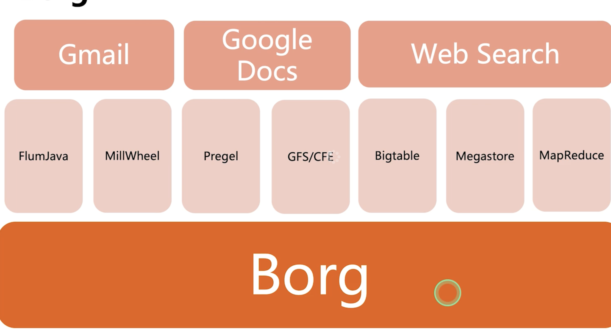

应用的业务- 在线业务 - 高可用
批处理的业务 离线业务 


## borg特性

- 资源利用率高
- 服务器共享，进程级别隔离
- 应用高可用
- 调度策略灵活
- 应用接入方便

优势:

对外隐藏了资源管理

### 基本概念

- workload 
  - prod 在线业务 和 non prod 离线业务
- cell 
  - 一个cell就是一个集群 
- Job 和 Task 
  - 多个job 组成一个task 
- naming 
  - 域名服务 微服务之间的调用
  
## borg架构


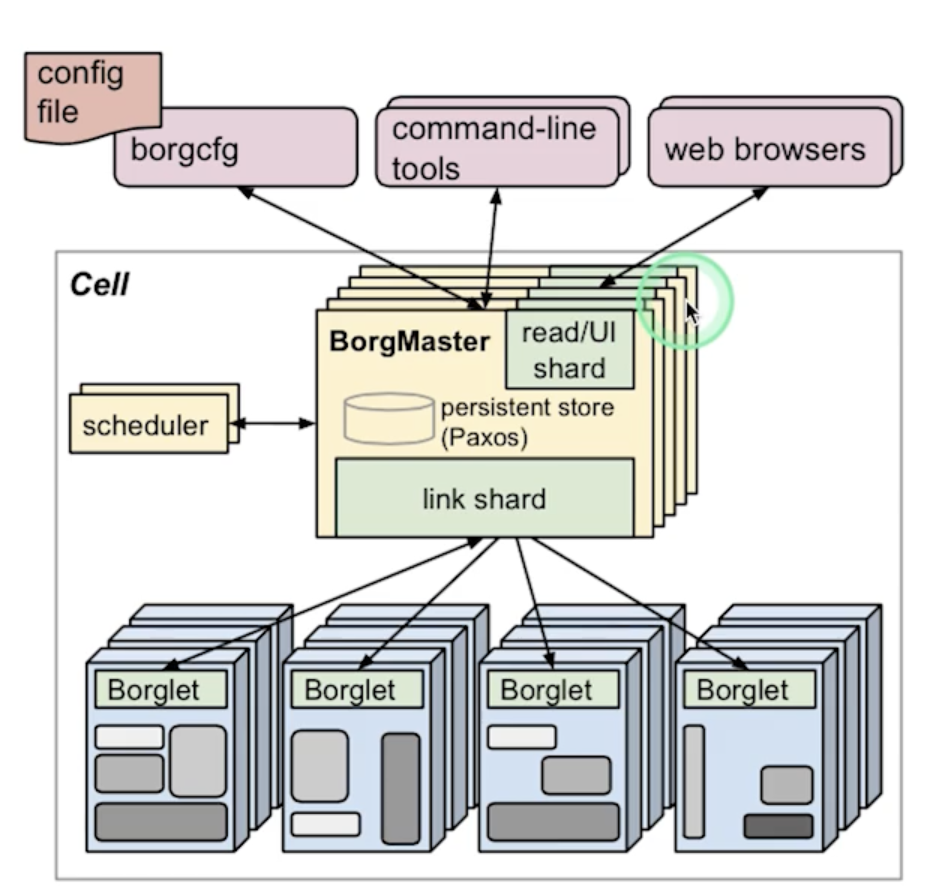

- bortmaster 主进程


- schedule 进程
   - 调度策略 
     - worst fit 
     - best fit 
   - 调度优化


- Borglet 
  - 是部署在所有服务器的agent,负责接受borgmaster进程的指令。
  

### 高可用

- 支持幂等 


## k8s

以borg为指导思维的容器技术的k8s 

## k8s声明式系统

- node 
- namespace 
- pod
- service :本质是负债均衡和域名服务的声明

### k8s架构

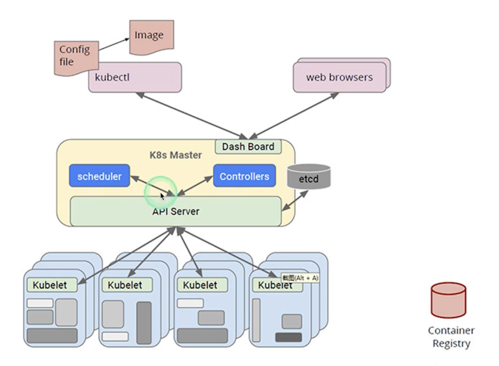

etcd是watch模式 


### 主要组件

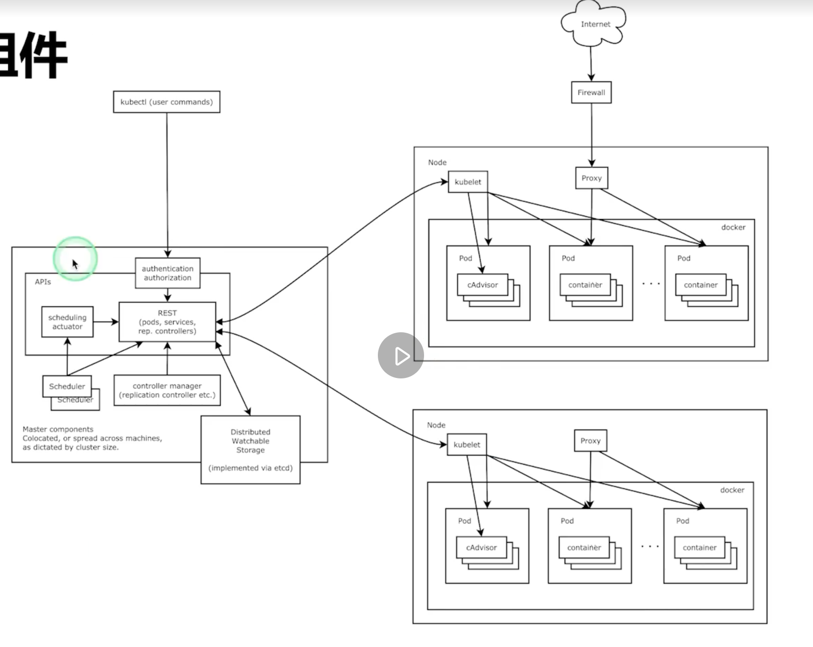

- kubelet 
   - 上报资源状态
   - 维护pod生命周期
- kube proxy 
   - 发布service， 上负载均衡


### k8s 主节点 

- API 服务器 API server

- 群的数据存储
  
  etcd

- 控制管理器
  
```
root@k8s-node1:~# kubectl get pod -n kube-system
NAME                                 READY   STATUS    RESTARTS      AGE
coredns-7f6cbbb7b8-4697l             1/1     Running   0             22h
coredns-7f6cbbb7b8-ds4kq             1/1     Running   0             22h
etcd-k8s-master                      1/1     Running   0             22h
kube-apiserver-k8s-master            1/1     Running   0             22h
kube-controller-manager-k8s-master   1/1     Running   1 (22h ago)   22h
kube-proxy-c528s                     1/1     Running   0             22h
kube-proxy-nhgtj                     1/1     Running   0             131m
kube-scheduler-k8s-master            1/1     Running   0             22h
``` 

## ETCD

CoreOS基于raft 协议的分布式k-v 存储。 

```
root@k8s-node1:~#  alias ks='kubectl -n kube-system'
root@k8s-node1:~# ks get pod
NAME                                 READY   STATUS    RESTARTS      AGE
coredns-7f6cbbb7b8-4697l             1/1     Running   0             22h
coredns-7f6cbbb7b8-ds4kq             1/1     Running   0             22h
etcd-k8s-master                      1/1     Running   0             22h
kube-apiserver-k8s-master            1/1     Running   0             22h
kube-controller-manager-k8s-master   1/1     Running   1 (22h ago)   22h
kube-proxy-c528s                     1/1     Running   0             22h
kube-proxy-nhgtj                     1/1     Running   0             134m
kube-scheduler-k8s-master            1/1     Running   0             22h
 
command terminated with exit code 126
root@k8s-node1:~# ks exec -it etcd-k8s-master  sh
kubectl exec [POD] [COMMAND] is DEPRECATED and will be removed in a future version. Use kubectl exec [POD] -- [COMMAND] instead.
```

### API server 

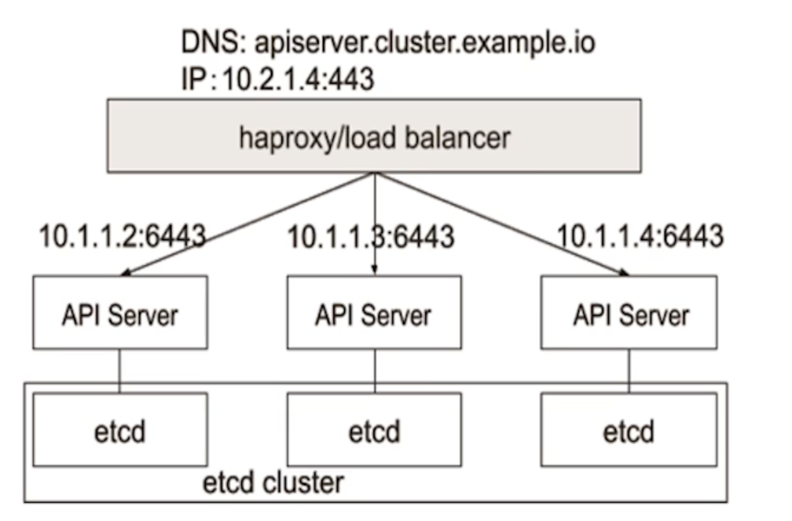

- 认证
- 授权
- 准入  Mutating && Validting 

只有api server 操作etcd

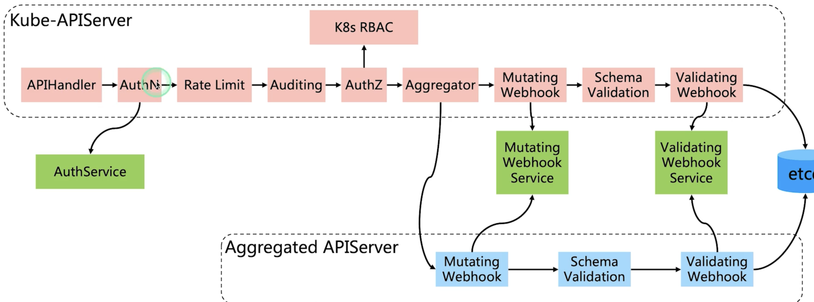

Aggregator 

### Controller manager 

是整个集群的大脑 

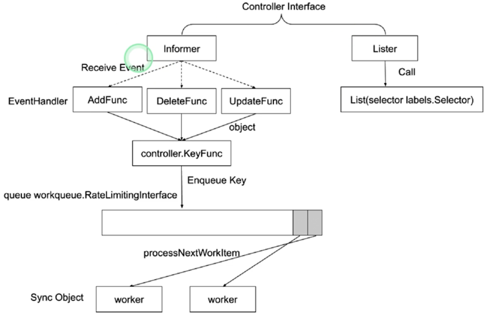

informer监听事件 

worker消费者 

- informer 的内部机制

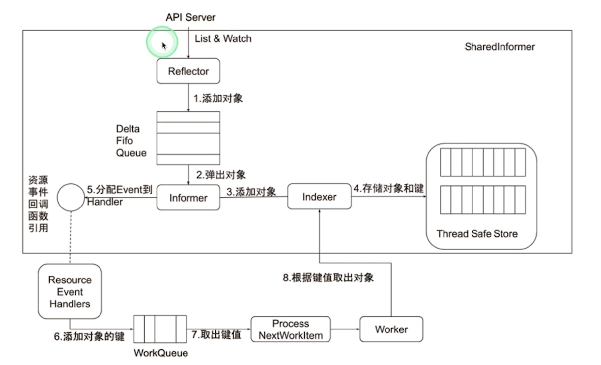

###  控制器协同工作原理
  
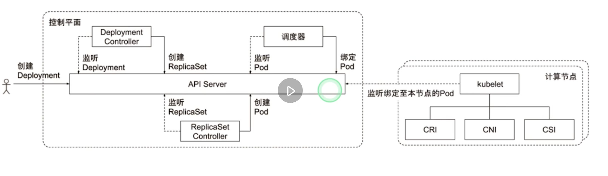


 ```
 root@k8s-master:~/go/src/github.com/darrenli6/101/module4#  k apply -f nginx-deploy.yaml -v 9
I1012 20:46:24.184543 1436999 loader.go:372] Config loaded from file:  /root/.kube/config
I1012 20:46:24.185786 1436999 round_trippers.go:435] curl -v -XGET  -H "Accept: application/com.github.proto-openapi.spec.v2@v1.0+protobuf" -H "User-Agent: kubectl/v1.22.2 (linux/amd64) kubernetes/8b5a191" 'https://172.17.187.45:6443/openapi/v2?timeout=32s'
I1012 20:46:24.228989 1436999 round_trippers.go:454] GET https://172.17.187.45:6443/openapi/v2?timeout=32s 200 OK in 43 milliseconds
I1012 20:46:24.229064 1436999 round_trippers.go:460] Response Headers:
I1012 20:46:24.229081 1436999 round_trippers.go:463]     Content-Type: application/octet-stream
I1012 20:46:24.229090 1436999 round_trippers.go:463]     Date: Wed, 12 Oct 2022 12:46:24 GMT
I1012 20:46:24.229099 1436999 round_trippers.go:463]     Etag: "827F92ED4625D5BDA6F7DE9724A8E3A7DD1C6D3F860C21CFE24D0EB88F4EA4FF8F0724F9910B956B868CD88879058312E0A62B6E0F7CAF964913F666C8B8EF00"
I1012 20:46:24.229112 1436999 round_trippers.go:463]     X-From-Cache: 1
I1012 20:46:24.229122 1436999 round_trippers.go:463]     Accept-Ranges: bytes
I1012 20:46:24.229131 1436999 round_trippers.go:463]     Cache-Control: no-cache, private
I1012 20:46:24.229139 1436999 round_trippers.go:463]     Vary: Accept-Encoding
I1012 20:46:24.229148 1436999 round_trippers.go:463]     Vary: Accept
I1012 20:46:24.229158 1436999 round_trippers.go:463]     X-Kubernetes-Pf-Flowschema-Uid: 5a6a2963-a762-46ab-a06c-2117ece60948
I1012 20:46:24.229167 1436999 round_trippers.go:463]     X-Varied-Accept: application/com.github.proto-openapi.spec.v2@v1.0+protobuf
I1012 20:46:24.229177 1436999 round_trippers.go:463]     Audit-Id: 054d4926-0f01-4276-91c0-1669a208f66c
I1012 20:46:24.229186 1436999 round_trippers.go:463]     X-Kubernetes-Pf-Prioritylevel-Uid: 5d38729a-ea29-4610-b95e-4a19febd7c24
I1012 20:46:24.229192 1436999 round_trippers.go:463]     Last-Modified: Tue, 11 Oct 2022 13:34:19 GMT
 ``` 

 ## Schedule 


 ## Add-ons

 kube-dns

 Ingress Controller 


 # 了解kubectl，深入理解k8s

## kube config 与 kubectl 
 ```
 root@k8s-master:~# kubectl get pod  -v 9
I1012 22:39:20.815948 1552368 loader.go:372] Config loaded from file:  /root/.kube/config
 ``` 


## 云计算的传统分类

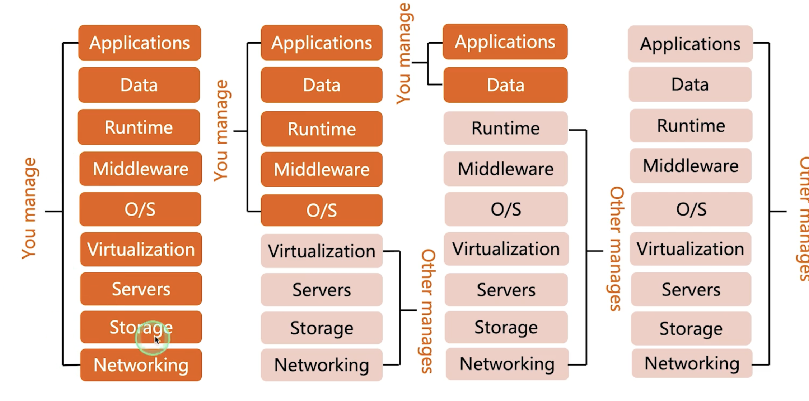

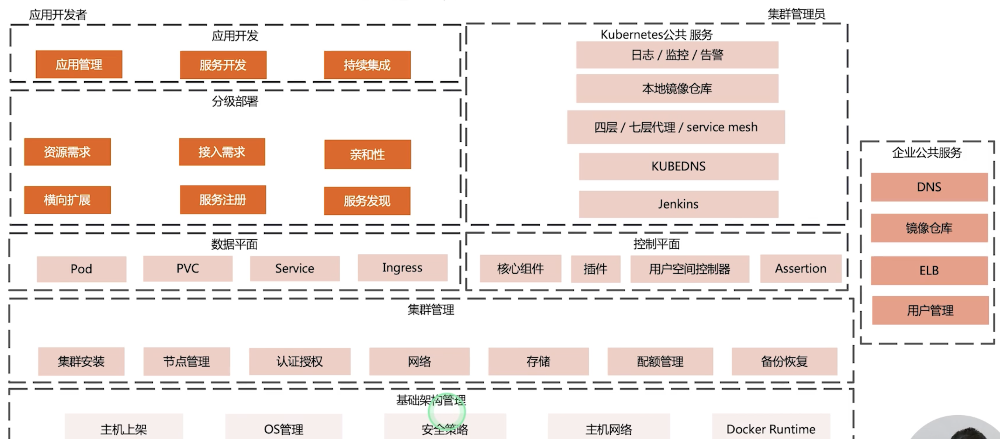

Paas相关性最大 

## k8s设计理念

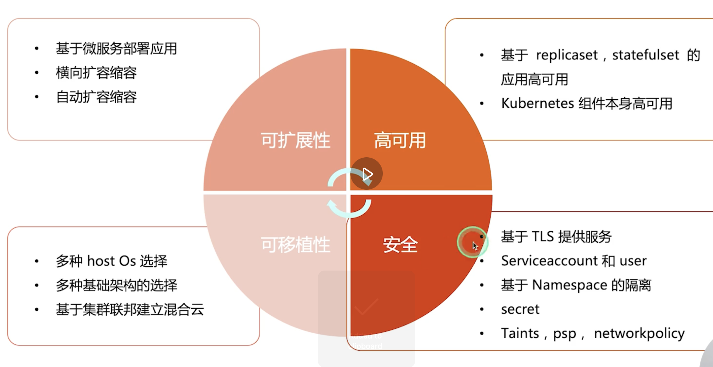

## 分层架构

- 核心层
- 应用层
- 管理层
- 接口层
- 生态系统

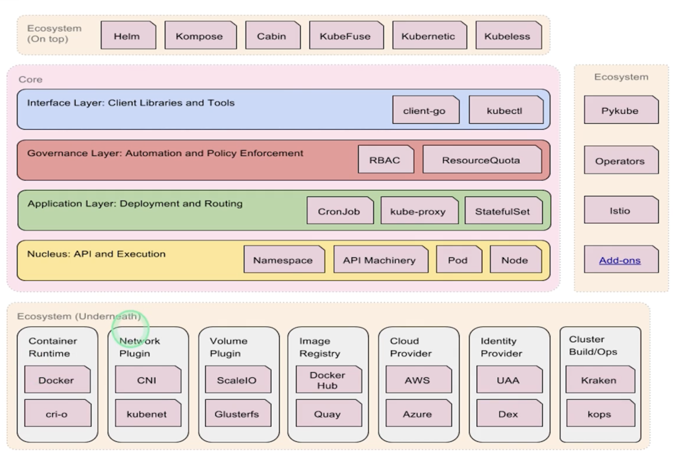

认证服务


## API设计原则

- 所有的API是声明式的
  声明最终的状态

- 彼此互补而且可以组合
  高内聚 松耦合
   
- 高层API是以操作意图为基础设计的

- 底层API根据高层API的控制而设计的
- 尽量避免简单封装
-  API操作复杂度与对象数量成正比
-  API对象状态不能依赖网络连接状态

## k8s如何通过对象的组合完成业务描述

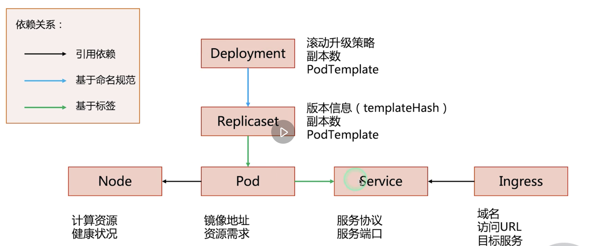

## k8s架构设计原则

- 只要API Server 可以直接访问etcd
- 单点故障不影响集群
- 优先使用监听不是轮询

 
# 深入理解k8s 二 

## metadata

### finalizer 
资源锁

### ResouceVersion 

乐观锁


