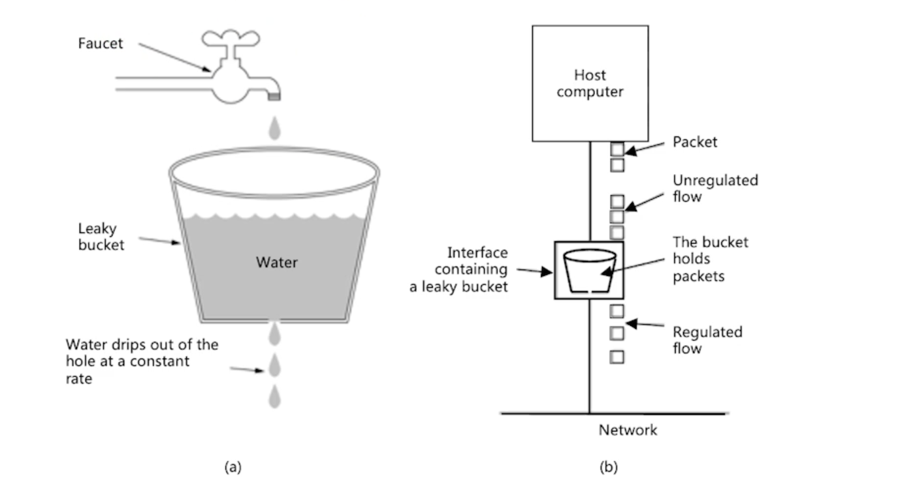
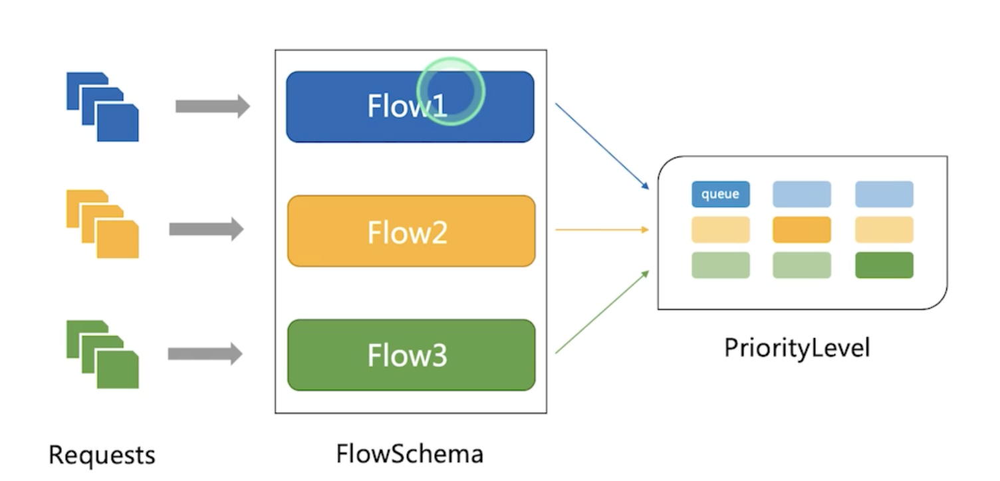

# API Server 

## 认证

- X509
- 静态token 
  - 简单的数据库 
  - csv格式
- 引导Token
- 静态密码文件
- ServiceAccount 
- OpenId
  - OAuth2 


### OAuth2 


生成config.json 

```
{
  "kind": "Config",
  "apiVersion": "v1",
  "preferences": {},
  "clusters": [
    {
      "name": "github-authn",
      "cluster": {
        "server": "http://192.168.34.2:3000/authenticate"
      }
    }
  ],
  "users": [
    {
      "name": "authn-apiserver",
      "user": {
        "token": "secret"
      }
    }
  ],
  "contexts": [
    {
      "name": "webhook",
      "context": {
        "cluster": "github-authn",
        "user": "authn-apiserver"
      }
    }
  ],
  "current-context": "webhook"
}
```

修改APIserver的配置，通过修改 `kube-apiserver.yaml`

```
- --authentication-token-webhook-config-file=/etc/config/webhook-config.json
```
开启认证服务，保证apiserver接受的请求通过认证服务认证。

```
- --authentication-token-webhook-cache-ttl = 2 
```
默认是2分钟的有效期 


## 授权

授权，是对k8s的资源的访问控制

### 授权处理的属性

- user,group
- API 请求方法
- 请求的资源
- Namespace
- API Group 

### 支持以下授权插件

- RBAC
- ABAC
- Webhook


## 限流

### 计数器固定窗口算法

设置限流窗口

如果在窗口切换的时候，突然增加访问，就会对系统造成压力

### 计数器滑动窗口算法

大周期切换成小周期 

小周期如果有大量请求呢 ？

### 漏斗算法




 server接受到的请求就是固定频率 

速率是恒定，如果突发的请求，多余的请求丢掉了

 ### 令牌桶算法

 对漏斗加强了
 去桶里拿令牌，拿到令牌，请求会被接受，另外有一个补充桶的令牌，如果突发的请求，桶里的令牌全拿走了。 


### API SERVER

 max-requests-inflight 给定时间内的最大请求数
 max-mutating-requests-inflight 

- 局限性
  - 粒度粗 
  - 单队列
    - 一个坏用户发送大量的请求，其他用户无法请求

### API Priority and Fairness



多队列 
多等级


```
root@k8s-master:~# kubectl get flowschema
NAME                           PRIORITYLEVEL     MATCHINGPRECEDENCE   DISTINGUISHERMETHOD   AGE    MISSINGPL
exempt                         exempt            1                    <none>                7d3h   False
probes                         exempt            2                    <none>                7d3h   False
system-leader-election         leader-election   100                  ByUser                7d3h   False
workload-leader-election       leader-election   200                  ByUser                7d3h   False
system-node-high               node-high         400                  ByUser                7d3h   False
system-nodes                   system            500                  ByUser                7d3h   False
kube-controller-manager        workload-high     800                  ByNamespace           7d3h   False
kube-scheduler                 workload-high     800                  ByNamespace           7d3h   False
kube-system-service-accounts   workload-high     900                  ByNamespace           7d3h   False
service-accounts               workload-low      9000                 ByUser                7d3h   False
global-default                 global-default    9900                 ByUser                7d3h   False
catch-all                      catch-all         10000                ByUser                7d3h   False
root@k8s-master:~# 
```

传入的请求通过flowschema 进行分类，分配优先级。

每个优先级维护各自的并发 

#### 排队

每个请求分配到一个流中，该流由对应的flowSchema 加上一个流区分项来标识 。

分配使用一种成为混洗分片的技术

#### 豁免请求
不需要限流  exempt   

```
apiVersion: flowcontrol.apiserver.k8s.io/v1beta1
kind: FlowSchema
metadata:
  annotations:
    apf.kubernetes.io/autoupdate-spec: "true"
  creationTimestamp: "2022-10-18T13:17:24Z"
  generation: 1
  name: system-leader-election
  resourceVersion: "65"
  uid: fe600713-5a62-4421-9572-1288dbf41744
spec:
  distinguisherMethod:
    type: ByUser
    # 优先级规则
  matchingPrecedence: 100
  # 优先等级
  priorityLevelConfiguration:
    name: leader-election
  rules: # 对应的资源和请求类型
  - resourceRules:
    - apiGroups:
      - ""
      namespaces:
      - kube-system
      resources:
      - endpoints
      - configmaps
      verbs:
      - get
      - create
      - update
    - apiGroups:
      - coordination.k8s.io
      namespaces:
      - '*'
      resources:
      - leases
      verbs:
      - get
      - create
      - update
    subjects:
    - kind: User
      user:
        name: system:kube-controller-manager
    - kind: User
      user:
        name: system:kube-scheduler
    - kind: ServiceAccount
      serviceAccount:
        name: '*'
        namespace: kube-system
status:
  conditions:
  - lastTransitionTime: "2022-10-18T13:17:24Z"
    message: This FlowSchema references the PriorityLevelConfiguration object named
      "leader-election" and it exists
    reason: Found
    status: "False"
    type: Dangling
```


## 高可用的API Server 
高可用 冗余部署+负载均衡


RingBuffer 缓冲读机制

### 善用RateLimit 


 max-requests-inflight 给定时间内的最大请求数
 max-mutating-requests-inflight 

 超过这两个参数，之后会被拒绝。

### 设置合适的缓冲

 --watch-cache-size 设置缓冲大小

### 客户端优先使用长链接
要用监听不要轮询


### 搭建多租户的集群

- 授信 
  - 认证
    - 不允许匿名
  - 授权


- 隔离
  - 可见行隔离
  - 资源隔离 
  - 应用访问隔离

- 资源
  Quota管理


## API Server 运作机制  


### GKV

group
kind
version 
- internel version   
- 和 external version 
- 版本转换

### 如何定义group


